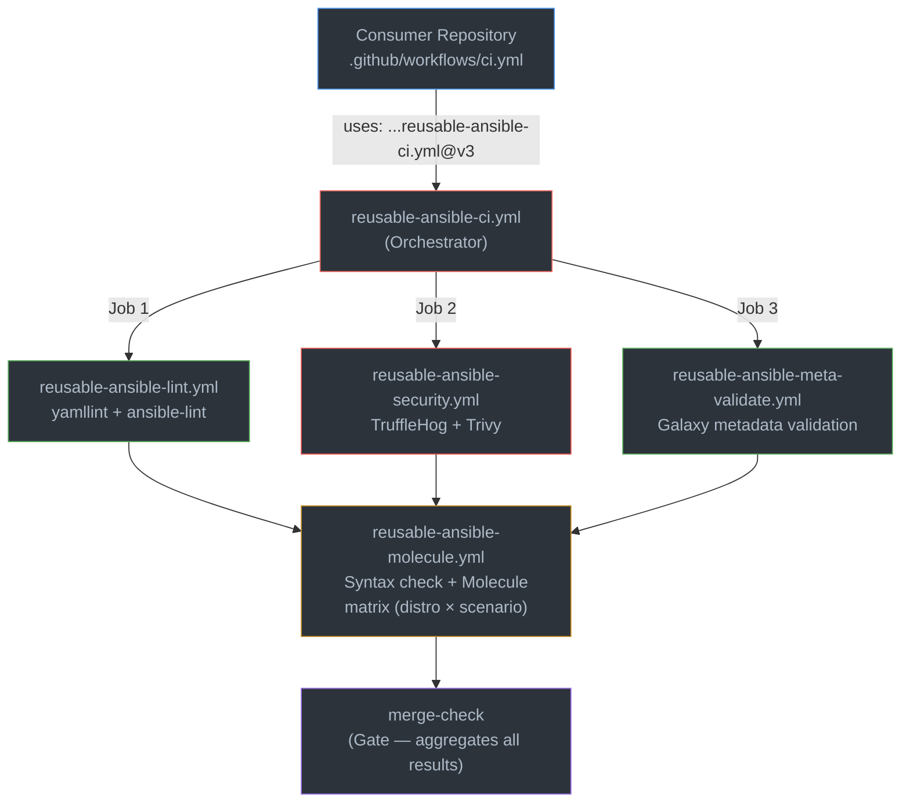
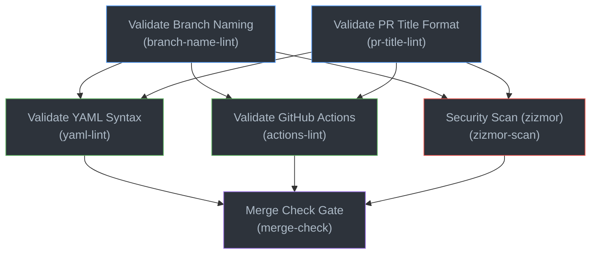

# GitHub Workflows

| Source                                                                                                            | Version                                                                                                                                | CI                                                                                                                                                              | License                                                           |
| ----------------------------------------------------------------------------------------------------------------- | -------------------------------------------------------------------------------------------------------------------------------------- | --------------------------------------------------------------------------------------------------------------------------------------------------------------- | ----------------------------------------------------------------- |
| [](https://github.com/grzegorzfranus/github-workflows) | [](https://github.com/grzegorzfranus/github-workflows/releases) | [](https://github.com/grzegorzfranus/github-workflows/actions/workflows/ci.yml) | [](LICENSE) |

Centralized, reusable, and secure GitHub Actions workflows and configuration templates designed to establish enterprise-grade CI/CD and repository hygiene standards.

This repository serves as a model blueprint ("wzór") for corporate workflows. It incorporates strict security hardening, automated release cycles, and automated local lints. The repository is designed to host multiple workflow categories — currently providing **Ansible** CI/CD pipelines, with additional technology stacks planned for the future.

## ✨ Features

- 🔒 **Immutable Third-Party Actions**: All external actions are pinned to their full 40-character commit SHA instead of mutable tags.
- 🔑 **Job-Level Least Privilege**: Strict job-level GITHUB_TOKEN permissions (`contents: read` default) to prevent unauthorized access.
- 🚀 **Isolated CI Executions**: Internal CI lint checks (`ci.yml`) run inside clean environments using `pipx run` to prevent python package pollution. Reusable Ansible workflows use isolated `pip install` within runner virtual environments.
- 🛡️ **Static Security Linting**: Built-in workflow scanning using `zizmor` to catch GITHUB_TOKEN leaks, command injections, and unsafe properties.
- 🤖 **Automated Release Management**: Zero-touch versioning, tagging, and changelog generation using Google Release Please.
- 📋 **Corporate Governance Templates**: Premium templates for pull requests and issues to streamline team review cycles.

## 🎯 Architecture

### Ansible CI Pipeline

The Ansible CI orchestrator coordinates all quality checks in a strict dependency chain:



**Execution order**: Lint, Security, and Metadata run in parallel → Molecule waits for all three → Merge Check Gate evaluates all results.

---

## 🔁 CI Pipeline (this repository)

Workflows in this repository are validated continuously to ensure compliance, YAML format correctness, and strict security posture.



---

## 🔑 Required GitHub Secrets

To use the Galaxy publish capabilities, you must configure the following secret in the repository settings:

| Secret Name | Purpose | Target Workflow |
| ----------- | ------- | --------------- |
| `GALAXY_API_KEY` | Ansible Galaxy token used to authorize the publishing of tagged releases. | `reusable-ansible-publish.yml` |

---

## 🤖 Dependabot Update Policy

This repository uses automated dependency management configuration defined under [`.github/dependabot.yml`](.github/dependabot.yml).

- **Schedule**: Checked weekly on Monday at 06:00 (Europe/Warsaw timezone).
- **Groupings**: `minor` and `patch` updates are grouped under a single pull request to reduce PR noise.
- **Limit**: Maximum of 10 open pull requests at any time.
- **Cooldown**: 14 days cooldown is applied to updates to ensure stability.
- **Pull Request Review**: All updates are reviewed manually and must pass local verification checks before staging and integration.

---

## 📋 Requirements

### For developers of this repository

- **Node.js**: Required for Husky Git hooks and commitlint (`npm install`).
- **Local Linters**: `yamllint`, `actionlint`, and `zizmor` are required for local verification before submitting code changes.
- **GitHub Runner**: Workflows are designed and tested on standard `ubuntu-latest` environments.

### For consumers (Ansible role repositories)

- **GitHub Actions**: The calling repository must use GitHub Actions with `workflow_call` support.
- **Permissions**: Caller workflows must declare `permissions: contents: read` (minimum).
- **Secrets** (publish only): `GALAXY_API_KEY` must be configured as a repository secret for `reusable-ansible-publish.yml`.
- **Supported Python**: `3.12` (default, configurable via `python-version` input).

---

## 🚀 Quick Start

### 1. Development Setup

Initialize development dependencies and activate local Git Hooks:
```bash
npm install
```

### 2. Manual Verification

To verify your workflow definitions manually:

```bash
# Run yamllint on workflow definitions
pipx run yamllint .github/workflows/*.yml

# Run actionlint to check actions schema
actionlint

# Run zizmor to check workflow security
pipx run zizmor .github/workflows
```

---

## ⚙️ Configuration

### 1. Branch Naming Convention

All branches created in this repository must use category prefixes and end with a kebab-case alphanumeric suffix (i.e. `[a-zA-Z0-9-]+`) to ensure a clean history:

- `feature/` — New workflows, features, or enhancements
- `bugfix/` — Fixing a bug in a workflow
- `fix/` — Standard bug fixes (e.g. `fix/typo`)
- `hotfix/` — Critical quick-fixes applied to production
- `release/` — Release branching (e.g. `release/v3.0.0`)
- `chore/` — Maintenance, updating dependencies
- `docs/` — Documentation updates
- `refactor/` — Code refactoring without behavior changes
- `test/` — Adding or fixing validation tests
- `build/` — Build system and dependency updates
- `ci/` — Pipeline-specific configurations and lint gates
- `perf/` — Performance improvements
- `revert/` — Reverting previous commits

### 2. Commit Message Convention

This repository strictly enforces Conventional Commits:

- `feat:` — Minor version bump (e.g. `1.0.0` ➡️ `1.1.0`)
- `fix:` — Patch version bump (e.g. `1.0.0` ➡️ `1.0.1`)
- `feat!:` / `BREAKING CHANGE:` — Major version bump (e.g. `1.0.0` ➡️ `2.0.0`)
- `docs:`, `chore:`, `refactor:`, `test:`, `ci:` — Changelog entry only (no bump)

### 3. Issue & PR Templates

All issues, tasks, and bug reports created in this repository must strictly follow the interactive forms defined under [`.github/ISSUE_TEMPLATE/`](.github/ISSUE_TEMPLATE/).

Similarly, all Pull Requests must be structured according to the template located under [`.github/PULL_REQUEST_TEMPLATE/pull_request_template.md`](.github/PULL_REQUEST_TEMPLATE/pull_request_template.md).

---

## 📦 Reusable Workflows

This repository provides modular, reusable workflows organized by technology stack. Additional workflow categories will be added as the repository evolves.

### Ansible Workflows

Workflows designed to standardize quality checks across Ansible role repositories.

#### 1. Ansible CI Orchestrator (`reusable-ansible-ci.yml`)

The primary CI pipeline. It coordinates the execution of linting, security, metadata validation, and functional integration tests in a strict dependency chain. Contains a final Merge Check Gate that aggregates all results into a single required status check.

**Inputs:**

| Input | Type | Required | Default | Description |
| --- | --- | --- | --- | --- |
| `ansible-lint-profile` | string | no | `"production"` | ansible-lint profile (e.g., `shared`, `production`) |
| `molecule-scenarios` | string | no | `'["default"]'` | JSON array of Molecule scenarios to run |
| `molecule-distros` | string | no | `'["ubuntu2404", "debian12", "rockylinux9"]'` | JSON array of distro containers to test against |
| `python-version` | string | no | `"3.12"` | Python version to use on the runner |
| `enable-trufflehog` | boolean | no | `true` | Enable TruffleHog secret scanning |
| `enable-trivy` | boolean | no | `true` | Enable Trivy IaC security scans |
| `enable-galaxy-metadata-check` | boolean | no | `true` | Enable Galaxy `meta/main.yml` validation (dedicated reusable-ansible-meta-validate.yml) |
| `molecule-timeout` | number | no | `30` | Timeout in minutes for Molecule test jobs |
| `requirements-ci-file` | string | no | `""` | Path to CI `requirements.txt` for pinned tool versions |
| `runner` | string | no | `"ubuntu-latest"` | Runner label to execute jobs on |

**Usage Example:**

Add the following to `.github/workflows/ci.yml` in your Ansible role repository:

```yaml
name: CI

on:
  pull_request:

permissions:
  contents: read

concurrency:
  group: ci-${{ github.ref }}
  cancel-in-progress: true

jobs:
  ansible-ci:
    uses: grzegorzfranus/github-workflows/.github/workflows/reusable-ansible-ci.yml@v3.0.0
    with:
      ansible-lint-profile: "production"
      molecule-distros: '["ubuntu2404", "debian12", "rockylinux9"]'
      molecule-scenarios: '["default"]'
      python-version: "3.12"
      enable-trufflehog: true
      enable-trivy: true
      enable-galaxy-metadata-check: true
```

---

#### 2. Ansible Galaxy Metadata Validation (`reusable-ansible-meta-validate.yml`)

Dedicated validation of Ansible Galaxy metadata structure and requirements. Validates presence and types of required fields, description length boundaries (255 chars limit, 20 chars minimum warning), platforms dictionary structure, tags conventions, role naming conventions, and dependencies format.

**Inputs:**

| Input | Type | Required | Default | Description |
| --- | --- | --- | --- | --- |
| `python-version` | string | no | `"3.12"` | Python version to use on the runner |
| `runner` | string | no | `"ubuntu-latest"` | Runner label to execute jobs on |

**Usage Example:**

```yaml
jobs:
  validate-metadata:
    uses: grzegorzfranus/github-workflows/.github/workflows/reusable-ansible-meta-validate.yml@v3.0.0
    with:
      python-version: "3.12"
```

---

#### 3. Ansible Galaxy Publish (`reusable-ansible-publish.yml`)

Publishes tagged role releases to Ansible Galaxy. Includes retry logic with exponential backoff (up to 3 attempts). Note: Metadata validation is NOT performed by this workflow and must be run beforehand (e.g. via `reusable-ansible-meta-validate.yml`).

**Inputs:**

| Input | Type | Required | Default | Description |
| --- | --- | --- | --- | --- |
| `python-version` | string | no | `"3.12"` | Python version to use on the runner |
| `runner` | string | no | `"ubuntu-latest"` | Runner label to execute jobs on |

**Secrets:**

| Secret | Required | Description |
| --- | --- | --- |
| `galaxy-api-key` | **yes** | Ansible Galaxy API Key for role publishing |

**Usage Example:**

Add the following to `.github/workflows/publish.yml` in your Ansible role repository:

```yaml
name: Publish

on:
  push:
    tags:
      - 'v*'

permissions:
  contents: read

jobs:
  validate-metadata:
    uses: grzegorzfranus/github-workflows/.github/workflows/reusable-ansible-meta-validate.yml@v3.0.0

  publish:
    needs: [validate-metadata]
    uses: grzegorzfranus/github-workflows/.github/workflows/reusable-ansible-publish.yml@v3.0.0
    with:
      python-version: "3.12"
    secrets:
      galaxy-api-key: ${{ secrets.GALAXY_API_KEY }}
```

---

#### 4. Ansible Lint (`reusable-ansible-lint.yml`)

Static YAML and Ansible linting. Contains yamllint and ansible-lint checks. Note: Galaxy metadata check has been deprecated in this workflow (moved to `reusable-ansible-meta-validate.yml`).

**Inputs:**

| Input | Type | Required | Default | Description |
| --- | --- | --- | --- | --- |
| `ansible-lint-profile` | string | no | `"production"` | ansible-lint profile (e.g., `shared`, `production`) |
| `python-version` | string | no | `"3.12"` | Python version to use on the runner |
| `requirements-ci-file` | string | no | `""` | Path to CI `requirements.txt` for pinned tool versions |
| `enable-galaxy-metadata-check` | boolean | no | `true` | [DEPRECATED] Ignored, moved to dedicated workflow |
| `runner` | string | no | `"ubuntu-latest"` | Runner label to execute jobs on |

**Usage Example:**

```yaml
jobs:
  lint:
    uses: grzegorzfranus/github-workflows/.github/workflows/reusable-ansible-lint.yml@v3.0.0
    with:
      ansible-lint-profile: "production"
```

---

#### 5. Ansible Security (`reusable-ansible-security.yml`)

TruffleHog secrets detection and Trivy IaC security scans. Each scanner can be independently enabled or disabled. Contains a Security Gate job.

**Inputs:**

| Input | Type | Required | Default | Description |
| --- | --- | --- | --- | --- |
| `enable-trufflehog` | boolean | no | `true` | Enable TruffleHog secret scanning |
| `enable-trivy` | boolean | no | `true` | Enable Trivy IaC security scans (HIGH/CRITICAL severity) |
| `runner` | string | no | `"ubuntu-latest"` | Runner label to execute jobs on |

**Usage Example:**

```yaml
jobs:
  security:
    uses: grzegorzfranus/github-workflows/.github/workflows/reusable-ansible-security.yml@v3.0.0
    with:
      enable-trufflehog: true
      enable-trivy: true
```

---

#### 6. Ansible Molecule Testing (`reusable-ansible-molecule.yml`)

Syntax checks and Molecule integration test matrix. Creates a test matrix from `molecule-scenarios × molecule-distros`. Contains a Molecule Gate job.

**Inputs:**

| Input | Type | Required | Default | Description |
| --- | --- | --- | --- | --- |
| `molecule-scenarios` | string | no | `'["default"]'` | JSON array of Molecule scenarios to run |
| `molecule-distros` | string | no | `'["ubuntu2404", "debian12", "rockylinux9"]'` | JSON array of distro containers to test against |
| `python-version` | string | no | `"3.12"` | Python version to use on the runner |
| `molecule-timeout` | number | no | `30` | Timeout in minutes for Molecule test jobs |
| `requirements-ci-file` | string | no | `""` | Path to CI `requirements.txt` for pinned tool versions |
| `runner` | string | no | `"ubuntu-latest"` | Runner label to execute jobs on |

**Usage Example:**

```yaml
jobs:
  molecule:
    uses: grzegorzfranus/github-workflows/.github/workflows/reusable-ansible-molecule.yml@v3.0.0
    with:
      molecule-distros: '["ubuntu2404", "debian12", "rockylinux9"]'
      molecule-scenarios: '["default"]'
      python-version: "3.12"
      molecule-timeout: 30
```

---

## 🔄 Migration to v3

Version `v3.0.0` introduces a breaking change by extracting the Ansible Galaxy metadata validation logic into a dedicated reusable workflow `reusable-ansible-meta-validate.yml`.

### Key Changes:
- **Publish Workflow**: The `reusable-ansible-publish.yml` workflow no longer executes `pre-publish-check` internally. Consuming repositories must run the metadata validation check before running the publish job.
- **Lint Workflow**: The `reusable-ansible-lint.yml` workflow no longer runs metadata checks. The `enable-galaxy-metadata-check` input is now deprecated and ignored.
- **Orchestrator**: The `reusable-ansible-ci.yml` coordinates the new validation as a separate job, running in parallel with Lint and Security, gating the Molecule tests.

### Upgrade Procedure for Consumers:
If using the orchestrator `reusable-ansible-ci.yml`, no configuration changes are required unless you explicitly disabled metadata checks. If using publish/lint workflows individually, ensure you call the metadata validation workflow:

```yaml
jobs:
  validate-metadata:
    uses: grzegorzfranus/github-workflows/.github/workflows/reusable-ansible-meta-validate.yml@v3.0.0

  publish:
    needs: [validate-metadata]
    uses: grzegorzfranus/github-workflows/.github/workflows/reusable-ansible-publish.yml@v3.0.0
    with:
      python-version: "3.12"
    secrets:
      galaxy-api-key: ${{ secrets.GALAXY_API_KEY }}
```

---

## 🔄 Migration to v2

Version `v2.0.0` introduces a breaking change by renaming all reusable workflows to standard kebab-case starting with the `reusable-` prefix. This aligns with corporate workflow design standards.

### Workflow Name Mapping

To upgrade, replace the `uses:` paths in your caller workflows according to the following mapping:

| Old Workflow Path | New Workflow Path (v2.0.0+) |
| ----------------- | --------------------------- |
| `.github/workflows/ansible-ci.yml` | `.github/workflows/reusable-ansible-ci.yml` |
| `.github/workflows/ansible-publish.yml` | `.github/workflows/reusable-ansible-publish.yml` |
| `.github/workflows/ansible-lint.yml` | `.github/workflows/reusable-ansible-lint.yml` |
| `.github/workflows/ansible-security.yml` | `.github/workflows/reusable-ansible-security.yml` |
| `.github/workflows/ansible-molecule.yml` | `.github/workflows/reusable-ansible-molecule.yml` |

---

## 🔄 Versioning & Upgrade

### Versioning Strategy

This repository uses [Semantic Versioning](https://semver.org/) with automated releases via [Google Release Please](https://github.com/googleapis/release-please).

**How to reference workflows in your repository:**

```yaml
# Recommended — pin to a specific release tag
uses: grzegorzfranus/github-workflows/.github/workflows/reusable-ansible-ci.yml@v2.0.0

# Alternative — pin to a commit SHA (most secure, immutable)
uses: grzegorzfranus/github-workflows/.github/workflows/reusable-ansible-ci.yml@abc123def456
```

> **Note**: Referencing `@main` is **not recommended** for production use — it tracks the latest commit and may include untested changes.

### Upgrade Procedure

1. Check the [Releases page](https://github.com/grzegorzfranus/github-workflows/releases) for the latest version and changelog.
2. Update the version tag in your caller workflow:

   ```diff
   -    uses: grzegorzfranus/github-workflows/.github/workflows/ansible-ci.yml@v1.2.0
   +    uses: grzegorzfranus/github-workflows/.github/workflows/reusable-ansible-ci.yml@v2.0.0
   ```

3. Review the changelog for new inputs, changed defaults, or breaking changes.
4. Submit a pull request in your repository and verify CI passes.

### Breaking Changes Policy

- **Major version bump** (`v1 → v2`): May remove inputs, change defaults, or alter behavior. Review the changelog carefully.
- **Minor version bump** (`v1.1 → v1.2`): New inputs with backward-compatible defaults. Safe to upgrade.
- **Patch version bump** (`v1.1.0 → v1.1.1`): Bug fixes only. Safe to upgrade.

---

## 🔍 Verification

After integrating the reusable workflows, verify they work correctly:

### Check CI Status

1. Open a pull request in your Ansible role repository.
2. Navigate to the **Actions** tab → verify the following jobs appear and pass:
   - `🔍 Lint` → yamllint, ansible-lint, Galaxy metadata check
   - `🔒 Security` → TruffleHog, Trivy
   - `🧪 Test` → Syntax check, Molecule matrix
   - `Merge Check Gate` → aggregated result

### Verify Publish Workflow

1. Create and push a new version tag: `git tag v2.0.0 && git push origin v2.0.0`
2. Navigate to the **Actions** tab → verify the Publish workflow runs successfully.
3. Check [Ansible Galaxy](https://galaxy.ansible.com/) for your published role.

### Common Issues

| Issue | Cause | Solution |
| --- | --- | --- |
| `Merge Check Gate` fails | One or more upstream jobs failed or were cancelled | Check individual job logs for errors |
| Publish fails with 403 | Invalid or missing `GALAXY_API_KEY` | Verify the secret is configured in repository settings |
| Molecule timeout | Tests exceed the default 30-minute limit | Increase `molecule-timeout` input |
| `meta/main.yml` validation fails | Missing required Galaxy metadata fields | Ensure `author`, `description`, `license`, `min_ansible_version`, and `platforms` are present |

---

## 🛡️ Security Features

- ✅ **SHA Pinned Actions**: Immutable external dependencies (e.g. `actions/checkout@9c091bb21b7c1c1d1991bb908d89e4e9dddfe3e0`).
- ✅ **Minimal Job Permissions**: Jobs elevate access only when required (e.g. `release-please` has `contents: write`, validation has `contents: read`).
- ✅ **Isolated Linters**: Internal CI uses `pipx run` for zero-install linting; reusable workflows use isolated `pip install` within runner environments.
- ✅ **Automated Branch Name Gate**: Rejects PR branches failing naming conventions.
- ✅ **Automated PR Title Gate**: Rejects PRs failing Conventional Commits formats.
- ✅ **Trivy IaC Scanning**: Fails on HIGH/CRITICAL severity findings with `exit-code: 1`.
- ✅ **TruffleHog Secret Scanning**: Full history scan (`fetch-depth: 0`) for leaked secrets.
- ✅ **zizmor Workflow Scan**: Static analysis security scan to prevent code injection and credential leakages.

### Pinned Action Versions

| Action | SHA | Version |
| --- | --- | --- |
| `actions/checkout` | `9c091bb21b7c1c1d1991bb908d89e4e9dddfe3e0` | v7.0.0 |
| `actions/setup-python` | `ece7cb06caefa5fff74198d8649806c4678c61a1` | v6.3.0 |
| `actions/cache` | `55cc8345863c7cc4c66a329aec7e433d2d1c52a9` | v6.1.0 |
| `trufflesecurity/trufflehog` | `00155c9dc586f34d189adc83d3ac2698c2ec551f` | v3.88.28 |
| `aquasecurity/trivy-action` | `ed142fd0673e97e23eac54620cfb913e5ce36c25` | v0.36.0 |

---

## 📁 File Structure

```
github-workflows/
├── .github/
│   ├── ISSUE_TEMPLATE/
│   │   ├── bug_report.yml             # Interactive Bug report form
│   │   ├── config.yml                 # Issue templates config
│   │   ├── feature_request.yml        # Interactive Feature request form
│   │   └── task.yml                   # Interactive Task chore form
│   ├── PULL_REQUEST_TEMPLATE/
│   │   └── pull_request_template.md   # PR checklist template
│   ├── workflows/
│   │   ├── reusable-ansible-ci.yml    # Ansible CI orchestrator
│   │   ├── reusable-ansible-lint.yml  # Reusable Ansible lint validations
│   │   ├── reusable-ansible-meta-validate.yml # Reusable Galaxy metadata validation
│   │   ├── reusable-ansible-molecule.yml # Reusable Molecule test runner
│   │   ├── reusable-ansible-publish.yml # Reusable Galaxy publish template
│   │   ├── reusable-ansible-security.yml # Reusable TruffleHog & Trivy scans
│   │   ├── ci.yml                     # Validator CI pipeline
│   │   └── release.yml                # Release Please automation
│   └── dependabot.yml                 # Actions dependency updates config
├── .husky/                            # Git hooks configuration (Husky)
│   ├── commit-msg                     # Commit message validation hook
│   └── pre-commit                     # Pre-commit workflows validation hook
├── scripts/
│   └── validate.sh                    # Pre-commit validation runner script
├── .gitignore                         # Git ignore configurations
├── .release-please-manifest.json      # Google Release Please version tracking
├── .yamllint                          # yamllint settings
├── CHANGELOG.md                       # Repository changelog
├── LICENSE                            # Apache-2.0 License
├── README.md                          # This documentation
├── commitlint.config.js               # Commitlint config file
├── package.json                       # Node dependencies file
├── release-please-config.json         # Google Release Please config
└── package-lock.json                  # Lock file for package.json
```

---

## 🤝 Contributing

Contributions, bug reports, and feature requests are welcome!

- Fork the repository and create your branch from `main`
- Use [Conventional Commits](https://www.conventionalcommits.org/) for commit messages:
  - `feat:` — new features (minor version bump)
  - `fix:` — bug fixes (patch version bump)
  - `docs:` — documentation changes
  - `refactor:` — code refactoring
  - `test:` — test additions
  - `ci:` — CI/CD changes
  - `chore:` — maintenance tasks
- Use branch naming convention: `feature/`, `bugfix/`, `hotfix/`, `docs/`, `refactor/`, `test/`, `chore/`, `ci/`
- Ensure your code passes all CI checks (YAML lint, Actions lint, zizmor)
- Submit a pull request describing your changes (a template is available under `.github/PULL_REQUEST_TEMPLATE/pull_request_template.md` to help structure your PR description)
- For major changes, please open an issue first to discuss what you would like to change (issue templates for bug reports, feature requests, and tasks are available under `.github/ISSUE_TEMPLATE/`)

---

## 📝 License

This project is licensed under the Apache-2.0 License - see the LICENSE file for details.

---

## 👥 Author Information

This repository was created by [Grzegorz Franus](https://github.com/grzegorzfranus).
