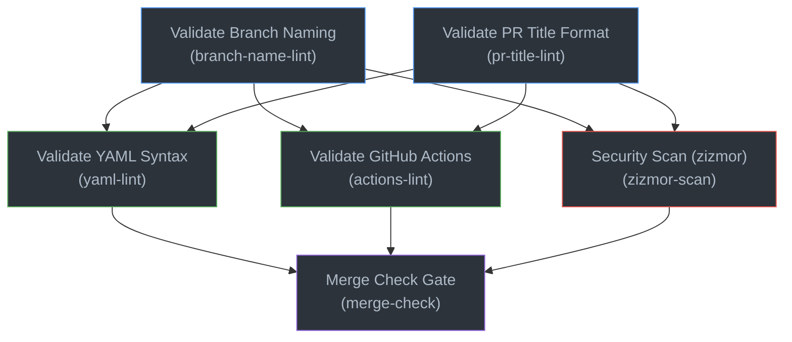
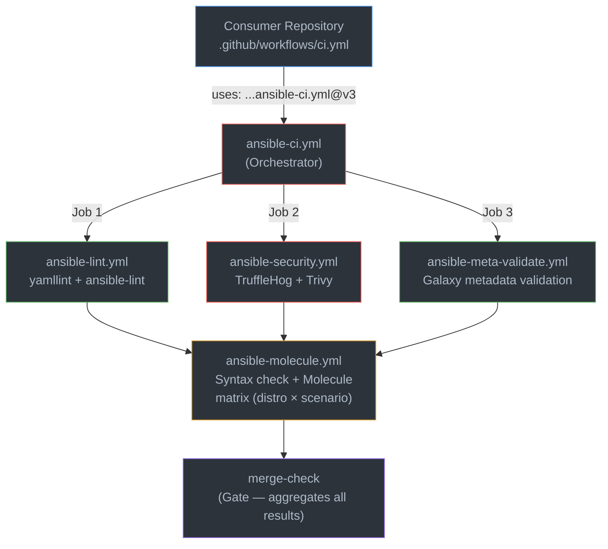

# GitHub Workflows

| Source | Version | CI | Pre-commit |
| --- | --- | --- | --- |
| [](https://github.com/grzegorzfranus/github-workflows) | [](https://github.com/grzegorzfranus/github-workflows/releases) | [](https://github.com/grzegorzfranus/github-workflows/actions/workflows/ci.yml) | [](LICENSE) |

Centralized, reusable, and secure GitHub Actions workflows and configuration templates designed to establish enterprise-grade CI/CD and repository hygiene standards.

This repository serves as a model blueprint ("wzór") for corporate workflows. It incorporates strict security hardening, automated release cycles, and automated local lints. The repository is designed to host multiple workflow categories — currently providing **Ansible** CI/CD pipelines, with additional technology stacks planned for the future.

## ✨ Features

- 🔒 **Immutable Third-Party Actions**: All external actions are pinned to their full 40-character commit SHA instead of mutable tags.
- 🔑 **Job-Level Least Privilege**: Strict job-level GITHUB_TOKEN permissions (`contents: read` default) to prevent unauthorized access.
- 🚀 **Isolated CI Executions**: Internal CI lint checks (`ci.yml`) run inside clean environments using `pipx run` to prevent python package pollution. Reusable Ansible workflows use isolated `pip install` within runner virtual environments.
- 🛡️ **Static Security Linting**: Built-in workflow scanning using `zizmor` to catch GITHUB_TOKEN leaks, command injections, and unsafe properties.
- 🤖 **Automated Release Management**: Zero-touch versioning, tagging, and changelog generation using Google Release Please.
- 📋 **Corporate Governance Templates**: Premium templates for pull requests and issues to streamline team review cycles.

## 📋 Requirements

### For developers of this repository

- **pre-commit**: Required for the local lint and commit message hooks (`pip install pre-commit`).
- **Local Linters**: `yamllint`, `actionlint`, and `zizmor` are required for local verification before submitting code changes.
- **GitHub Runner**: Workflows are designed and tested on standard `ubuntu-latest` environments.

### For consumers (Ansible role repositories)

- **GitHub Actions**: The calling repository must use GitHub Actions with `workflow_call` support.
- **Permissions**: Caller workflows must declare `permissions: contents: read` (minimum).
- **Secrets** (publish only): `GALAXY_API_KEY` must be configured as a repository secret for `ansible-publish.yml`.
- **Supported Python**: `3.12` (default, configurable via `python-version` input).

---

## 🚀 Quick Start

### 1. Development Setup

Initialize development dependencies and activate local Git Hooks:

```bash
pre-commit install --hook-type pre-push
pre-commit install --hook-type commit-msg
```

### 2. Manual Verification

To verify your workflow definitions manually:

```bash
# Run yamllint on workflow definitions
pipx run yamllint .github/workflows/*.yml

# Run actionlint to check actions schema
actionlint

# Run zizmor to check workflow security
pipx run zizmor .github/workflows
```

---

## 📦 Reusable Workflows

This repository provides modular, reusable workflows organized by technology stack. Additional workflow categories will be added as the repository evolves.

### Ansible Workflows

Each reusable workflow has its own reference page with a full input table and a usage example.

| Workflow | Purpose | Reference |
| --- | --- | --- |
| `ansible-ci.yml` | Orchestrates lint, security, metadata and Molecule for a role repository | [docs](docs/workflows/ansible-ci.md) |
| `ansible-lint.yml` | yamllint and ansible-lint static analysis | [docs](docs/workflows/ansible-lint.md) |
| `ansible-meta-validate.yml` | Galaxy metadata and role variable contract validation | [docs](docs/workflows/ansible-meta-validate.md) |
| `ansible-molecule.yml` | Syntax check and Molecule matrix testing | [docs](docs/workflows/ansible-molecule.md) |
| `ansible-publish.yml` | Publishes a validated role to Ansible Galaxy | [docs](docs/workflows/ansible-publish.md) |
| `ansible-security.yml` | TruffleHog secret scanning and Trivy IaC scanning | [docs](docs/workflows/ansible-security.md) |

---

## 📁 File Structure

```text
github-workflows/
├── .github/
│   ├── ISSUE_TEMPLATE/
│   │   ├── bug_report.yml             # Interactive Bug report form
│   │   ├── config.yml                 # Issue templates config
│   │   ├── feature_request.yml        # Interactive Feature request form
│   │   └── task.yml                   # Interactive Task chore form
│   ├── PULL_REQUEST_TEMPLATE/
│   │   └── pull_request_template.md   # PR checklist template
│   ├── workflows/
│   │   ├── ansible-ci.yml    # Ansible CI orchestrator
│   │   ├── ansible-lint.yml  # Reusable Ansible lint validations
│   │   ├── ansible-meta-validate.yml # Reusable Galaxy metadata validation
│   │   ├── ansible-molecule.yml # Reusable Molecule test runner
│   │   ├── ansible-publish.yml # Reusable Galaxy publish template
│   │   ├── ansible-security.yml # Reusable TruffleHog & Trivy scans
│   │   ├── ci.yml                     # Validator CI pipeline
│   │   └── release.yml                # Release Please automation
│   └── dependabot.yml                 # Actions dependency updates config
├── .gitignore                         # Git ignore configurations
├── .pre-commit-config.yaml            # Local lint and commit message hooks
├── .release-please-manifest.json      # Google Release Please version tracking
├── .yamllint                          # yamllint settings
├── CHANGELOG.md                       # Repository changelog
├── LICENSE                            # Apache-2.0 License
├── README.md                          # This documentation
├── commitlint.config.js               # Commitlint config file
└── release-please-config.json         # Google Release Please config
```

---

## 🧭 Design Principles

| Principle | Rationale | Applied As |
| --- | --- | --- |
| **Commit SHA Pinning** | Mutable tags can be repointed at malicious code after review. | Every third-party action is pinned to a 40-character commit SHA with the version in a trailing comment. |
| **Least Privilege** | A leaked token should be able to do as little as possible. | Every job declares its own `permissions` block rather than inheriting a broad default. |
| **Fail Fast** | Runner minutes spent on a pull request that cannot merge are wasted. | Branch name and pull request title are validated before any linting or test job runs. |
| **Reproducible Tooling** | An unpinned linter makes a green run unreproducible a week later. | `pipx run` invocations pin exact tool versions. |
| **Single Merge Gate** | Branch protection should depend on one status, not a growing list. | All checks feed one aggregated merge gate job. |

---

## 🔁 CI Pipeline (this repository)

Workflows in this repository are validated continuously to ensure compliance, YAML format correctness, and strict security posture.


```mermaid
graph TD
    A["Validate Branch Naming<br/>(branch-name-lint)"] & B["Validate PR Title Format<br/>(pr-title-lint)"] --> C["Validate YAML Syntax<br/>(yaml-lint)"]
    A & B --> D["Validate GitHub Actions<br/>(actions-lint)"]
    A & B --> E["Security Scan (zizmor)<br/>(zizmor-scan)"]
    C & D & E --> F["Merge Check Gate<br/>(merge-check)"]

    style A fill:#2d333b,stroke:#539bf5,color:#adbac7
    style B fill:#2d333b,stroke:#539bf5,color:#adbac7
    style C fill:#2d333b,stroke:#57ab5a,color:#adbac7
    style D fill:#2d333b,stroke:#57ab5a,color:#adbac7
    style E fill:#2d333b,stroke:#e5534b,color:#adbac7
    style F fill:#2d333b,stroke:#986ee2,color:#adbac7
```

---

## 🎯 Ansible CI Pipeline

The Ansible CI orchestrator coordinates all quality checks in a strict dependency chain:


```mermaid
graph TD
    A["Consumer Repository<br/>.github/workflows/ci.yml"] -->|"uses: ...ansible-ci.yml@v3"| B["ansible-ci.yml<br/>(Orchestrator)"]
    B -->|"Job 1"| C["ansible-lint.yml<br/>yamllint + ansible-lint"]
    B -->|"Job 2"| D["ansible-security.yml<br/>TruffleHog + Trivy"]
    B -->|"Job 3"| G["ansible-meta-validate.yml<br/>Galaxy metadata validation"]
    C --> E["ansible-molecule.yml<br/>Syntax check + Molecule<br/>matrix (distro × scenario)"]
    D --> E
    G --> E
    E --> F["merge-check<br/>(Gate — aggregates all results)"]

    style A fill:#2d333b,stroke:#539bf5,color:#adbac7
    style B fill:#2d333b,stroke:#f47067,color:#adbac7
    style C fill:#2d333b,stroke:#57ab5a,color:#adbac7
    style D fill:#2d333b,stroke:#e5534b,color:#adbac7
    style E fill:#2d333b,stroke:#c69026,color:#adbac7
    style F fill:#2d333b,stroke:#986ee2,color:#adbac7
    style G fill:#2d333b,stroke:#57ab5a,color:#adbac7
```

**Execution order**: Lint, Security, and Metadata run in parallel → Molecule waits for all three → Merge Check Gate evaluates all results.

---

## ⚙️ Configuration

### 1. Branch Naming Convention

All branches created in this repository must use category prefixes and end with a kebab-case alphanumeric suffix (i.e. `[a-zA-Z0-9-]+`) to ensure a clean history:

- `feature/` — New workflows, features, or enhancements
- `bugfix/` — Fixing a bug in a workflow
- `fix/` — Standard bug fixes (e.g. `fix/typo`)
- `hotfix/` — Critical quick-fixes applied to production
- `release/` — Release branching (e.g. `release/v3.0.0`)
- `chore/` — Maintenance, updating dependencies
- `docs/` — Documentation updates
- `refactor/` — Code refactoring without behavior changes
- `test/` — Adding or fixing validation tests
- `build/` — Build system and dependency updates
- `ci/` — Pipeline-specific configurations and lint gates
- `perf/` — Performance improvements
- `revert/` — Reverting previous commits

> These conventions are enforced automatically. The `branch-name-lint` job in [`ci.yml`](.github/workflows/ci.yml) rejects any pull request branch that does not match, and `pr-title-lint` applies the Conventional Commits check to the pull request title. Branches created by automation are exempt: `release-please--*` and `dependabot/*` are allowed through.

### 2. Commit Message Convention

This repository strictly enforces Conventional Commits:

- `feat:` — Minor version bump (e.g. `1.0.0` ➡️ `1.1.0`)
- `fix:` — Patch version bump (e.g. `1.0.0` ➡️ `1.0.1`)
- `feat!:` / `BREAKING CHANGE:` — Major version bump (e.g. `1.0.0` ➡️ `2.0.0`)
- `docs:`, `chore:`, `refactor:`, `test:`, `ci:` — Changelog entry only (no bump)

### 3. Issue & PR Templates

All issues, tasks, and bug reports created in this repository must strictly follow the interactive forms defined under [`.github/ISSUE_TEMPLATE/`](.github/ISSUE_TEMPLATE/).

Similarly, all Pull Requests must be structured according to the template located under [`.github/PULL_REQUEST_TEMPLATE/pull_request_template.md`](.github/PULL_REQUEST_TEMPLATE/pull_request_template.md).

---

## 🔍 Verification

After integrating the reusable workflows, verify they work correctly:

### Check CI Status

1. Open a pull request in your Ansible role repository.
2. Navigate to the **Actions** tab → verify the following jobs appear and pass:
   - `🔍 Lint` → yamllint, ansible-lint, Galaxy metadata check
   - `🔒 Security` → TruffleHog, Trivy
   - `🧪 Test` → Syntax check, Molecule matrix
   - `Merge Check Gate` → aggregated result

### Verify Publish Workflow

1. Create and push a new version tag in your role repository, for example `git tag v1.0.0 && git push origin v1.0.0`
2. Navigate to the **Actions** tab → verify the Publish workflow runs successfully.
3. Check [Ansible Galaxy](https://galaxy.ansible.com/) for your published role.

### Common Issues

| Issue | Cause | Solution |
| --- | --- | --- |
| `Merge Check Gate` fails | One or more upstream jobs failed or were cancelled | Check individual job logs for errors |
| Publish fails with 403 | Invalid or missing `GALAXY_API_KEY` | Verify the secret is configured in repository settings |
| Molecule timeout | Tests exceed the default 30-minute limit | Increase `molecule-timeout` input |
| `meta/main.yml` validation fails | Missing required Galaxy metadata fields | Ensure `author`, `description`, `license`, `min_ansible_version`, and `platforms` are present |

---

## 🔄 Versioning & Upgrade

### Versioning Strategy

This repository uses [Semantic Versioning](https://semver.org/) with automated releases via [Google Release Please](https://github.com/googleapis/release-please).

**How to reference workflows in your repository:**

```yaml
# Recommended — pin to a specific release tag
uses: grzegorzfranus/github-workflows/.github/workflows/ansible-ci.yml@v3.1.5

# Alternative — pin to a commit SHA (most secure, immutable)
uses: grzegorzfranus/github-workflows/.github/workflows/ansible-ci.yml@fbc6f3992d24b796d5a048ff273f7fcc4a7b6c09
```

> **Note**: Referencing `@main` is **not recommended** for production use — it tracks the latest commit and may include untested changes.

### Upgrade Procedure

1. Check the [Releases page](https://github.com/grzegorzfranus/github-workflows/releases) for the latest version and changelog.
2. Update the version tag in your caller workflow:

   ```diff
   -    uses: grzegorzfranus/github-workflows/.github/workflows/ansible-ci.yml@v3.1.4
   +    uses: grzegorzfranus/github-workflows/.github/workflows/ansible-ci.yml@v3.1.5
   ```

3. Review the changelog for new inputs, changed defaults, or breaking changes.
4. Submit a pull request in your repository and verify CI passes.

### Breaking Changes Policy

- **Major version bump** (`v1 → v2`): May remove inputs, change defaults, or alter behavior. Review the changelog carefully.
- **Minor version bump** (`v1.1 → v1.2`): New inputs with backward-compatible defaults. Safe to upgrade.
- **Patch version bump** (`v1.1.0 → v1.1.1`): Bug fixes only. Safe to upgrade.

---

## 🛡️ Security Features

- ✅ **SHA Pinned Actions**: Immutable external dependencies (e.g. `actions/checkout@fbc6f3992d24b796d5a048ff273f7fcc4a7b6c09`).
- ✅ **Minimal Job Permissions**: Jobs elevate access only when required (e.g. `release-please` has `contents: write`, validation has `contents: read`).
- ✅ **Isolated Linters**: Internal CI uses `pipx run` for zero-install linting; reusable workflows use isolated `pip install` within runner environments.
- ✅ **Automated Branch Name Gate**: Rejects PR branches failing naming conventions.
- ✅ **Automated PR Title Gate**: Rejects PRs failing Conventional Commits formats.
- ✅ **Trivy IaC Scanning**: Fails on HIGH/CRITICAL severity findings with `exit-code: 1`.
- ✅ **TruffleHog Secret Scanning**: Full history scan (`fetch-depth: 0`) for leaked secrets.
- ✅ **zizmor Workflow Scan**: Static analysis security scan to prevent code injection and credential leakages.

### Pinned Action Versions

| Action | SHA | Version |
| --- | --- | --- |
| `actions/checkout` | `fbc6f3992d24b796d5a048ff273f7fcc4a7b6c09` | v5.1.0 |
| `actions/setup-python` | `5fda3b95a4ea91299a34e894583c3862153e4b97` | v7.0.0 |
| `actions/cache` | `55cc8345863c7cc4c66a329aec7e433d2d1c52a9` | v6.1.0 |
| `trufflesecurity/trufflehog` | `bcfcf73aaf4759d4dadc2783177c245a02792318` | v3.97.0 |
| `aquasecurity/trivy-action` | `ed142fd0673e97e23eac54620cfb913e5ce36c25` | v0.36.0 |
| `googleapis/release-please-action` | `45996ed1f6d02564a971a2fa1b5860e934307cf7` | v5.0.0 |
| `raven-actions/actionlint` | `3d39aea434753780c3b3d4a1a31c854b4dbf49d7` | v2.2.0 |

---

## 🤖 Dependabot Update Policy

This repository uses automated dependency management configuration defined under [`.github/dependabot.yml`](.github/dependabot.yml).

- **Schedule**: Checked weekly on Monday at 06:00 (Europe/Warsaw timezone).
- **Groupings**: `minor` and `patch` updates are grouped under a single pull request to reduce PR noise.
- **Limit**: Maximum of 10 open pull requests at any time.
- **Cooldown**: 14 days cooldown is applied to updates to ensure stability.
- **Commit Messages**: Update pull requests use the `build` Conventional Commit prefix with scope included, and carry the `dependencies` and `github-actions` labels.
- **Held Majors**: `actions/checkout` is pinned to the v5 line and updates to v6 and above are ignored. From v6 onwards checkout writes credentials through an `includeIf "gitdir:"` directive, which fails to match when a self-hosted runner's `_work` directory is a symlink ([actions/checkout#2393](https://github.com/actions/checkout/issues/2393), still open). Patch and minor updates within v5.x are still accepted, so security backports on that line keep arriving.
- **Coupled Pins**: TruffleHog is pinned twice, once by action SHA and once by the `with: version:` input naming the scanner binary. Dependabot only updates the SHA, so every TruffleHog bump must have the `version:` input adjusted in review or the newer action will keep scanning with the older binary.
- **Pull Request Review**: All updates are reviewed manually and must pass local verification checks before staging and integration.

---

## 🔑 Required GitHub Secrets

To use the Galaxy publish capabilities, you must configure the following secret in the repository settings:

| Secret Name | Purpose | Target Workflow |
| ----------- | ------- | --------------- |
| `GALAXY_API_KEY` | Ansible Galaxy token used to authorize the publishing of tagged releases. | `ansible-publish.yml` |

---

## 🤝 Contributing

Contributions, bug reports, and feature requests are welcome!

- Fork the repository and create your branch from `main`
- Use [Conventional Commits](https://www.conventionalcommits.org/) for commit messages:
  - `feat:` — new features (minor version bump)
  - `fix:` — bug fixes (patch version bump)
  - `docs:` — documentation changes
  - `refactor:` — code refactoring
  - `test:` — test additions
  - `ci:` — CI/CD changes
  - `chore:` — maintenance tasks
- Use branch naming convention: `feature/`, `bugfix/`, `hotfix/`, `docs/`, `refactor/`, `test/`, `chore/`, `ci/`
- Ensure your code passes all CI checks (YAML lint, Actions lint, zizmor)
- Submit a pull request describing your changes (a template is available under `.github/PULL_REQUEST_TEMPLATE/pull_request_template.md` to help structure your PR description)
- For major changes, please open an issue first to discuss what you would like to change (issue templates for bug reports, feature requests, and tasks are available under `.github/ISSUE_TEMPLATE/`)

---

## 📝 License

This project is licensed under the Apache-2.0 License - see the LICENSE file for details.

---

## 👥 Author Information

This repository was created by [Grzegorz Franus](https://github.com/grzegorzfranus).
